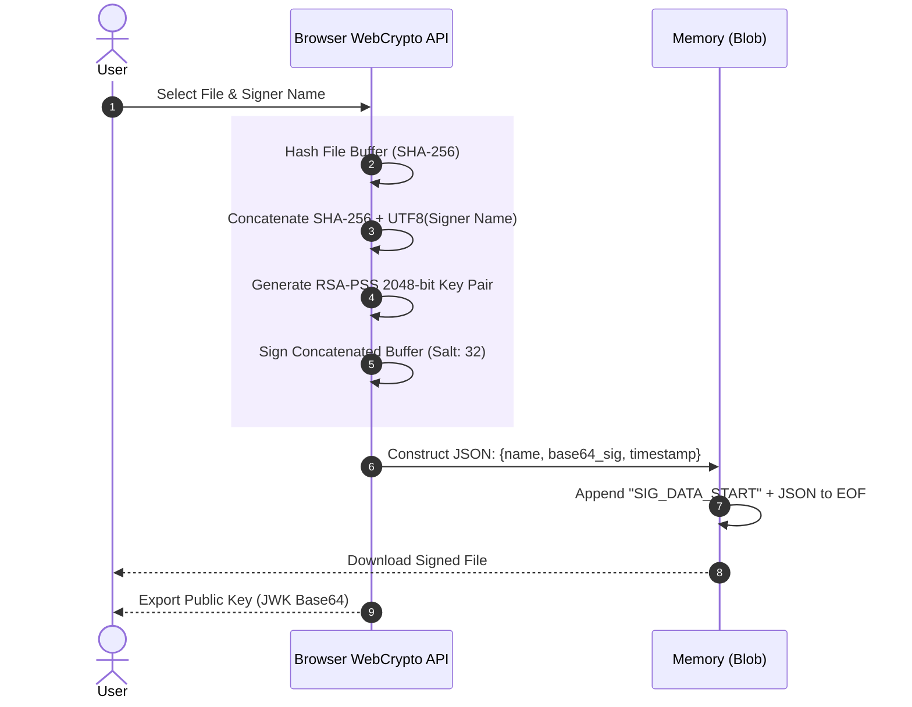
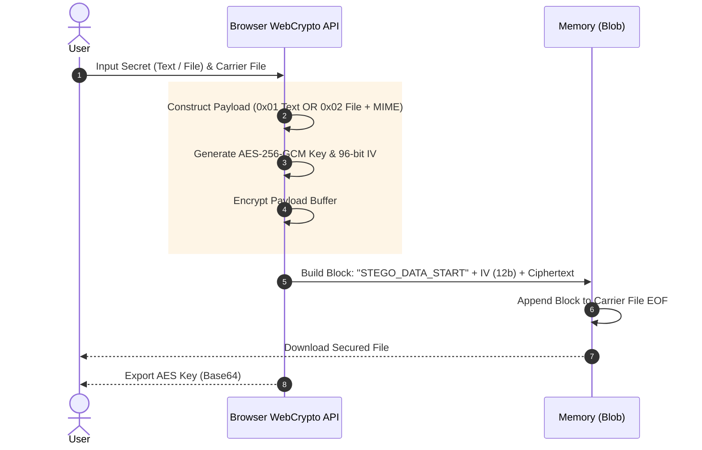
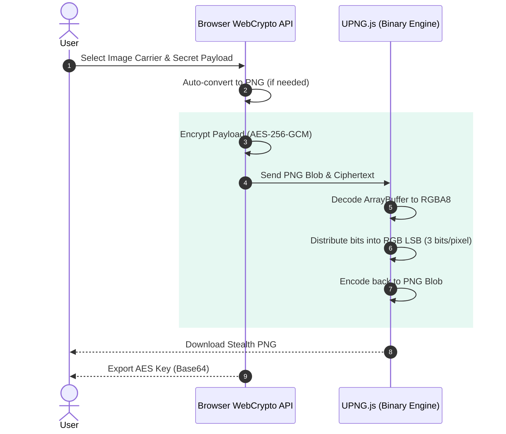

# 🛡️ CryptoSeal
> **A Privacy-First Cryptographic Toolkit for Digital Signatures and Encrypted Steganography.**

🔥 [View Live Application](https://crypto-seal-nine.vercel.app/)


## Table of Contents
- [Project Philosophy](#project-philosophy)
- [Why CryptoSeal?](#why-cryptoseal)
- [Feature Comparison](#feature-comparison)
- [Architecture & Data Flow](#architecture--data-flow)
  - [Digital Signature Mechanism](#1-digital-signature-mechanism)
  - [Steganography Engine A: Standard EOF Injection](#2-steganography-engine-a-standard-eof-injection)
  - [Steganography Engine B: Deep Pixel LSB Stealth](#3-steganography-engine-b-deep-pixel-lsb-stealth)
- [Cryptographic Specifications](#cryptographic-specifications)
- [Security & Privacy](#security--privacy)
- [Threat Model](#threat-model)
- [Technology Stack](#technology-stack)
- [Project Structure](#project-structure)
- [Installation & Usage](#installation--usage)
- [Browser Compatibility](#browser-compatibility)
- [Roadmap](#roadmap)
- [License](#license)
- [Author](#author)

---

## Project Philosophy
CryptoSeal exists to democratize secure, verifiable communication. As data privacy concerns escalate, relying on centralized servers to process sensitive cryptographic operations introduces unnecessary vulnerabilities. 

We engineered CryptoSeal as a **100% client-side, browser-only** application. By shifting the cryptographic workload directly to the user's device via the native WebCrypto API, we eliminate the need for backends, databases, and network transit. The result is a stateless environment where you maintain absolute sovereignty over your keys and data.

## Why CryptoSeal?
Traditional digital signature and encryption platforms require you to upload your files to their servers, inherently requiring you to trust their infrastructure, storage policies, and network security. 

CryptoSeal flips this model:
- **Everything happens locally.**
- **Nothing leaves your device.**
- **No accounts or subscriptions.**
- **No servers.**
- **No internet required once loaded.**

## Feature Comparison
| Feature | CryptoSeal | Traditional Online Tools | CLI Tools (GPG/OpenSSL) |
| :--- | :---: | :---: | :---: |
| **Local Processing** | ✅ | ❌ | ✅ |
| **Zero-Knowledge** | ✅ | ❌ | ✅ |
| **No Installation Required** | ✅ | ✅ | ❌ |
| **RSA-PSS Signatures** | ✅ | Some | ✅ |
| **AES-GCM Steganography** | ✅ | ❌ | ❌ |
| **Universal OS Support** | ✅ | ✅ | Varies |

## Architecture & Data Flow

CryptoSeal implements three distinct cryptographic engines, each meticulously engineered to run natively within the browser's memory without reliance on external servers.

### 1. Digital Signature Mechanism
The signature engine appends a verifiable identity proof to any file using End-of-File (EOF) injection.



### 2. Steganography Engine A: Standard EOF Injection
Designed for speed and universal file support, this engine injects AES-256-GCM encrypted payloads directly into the EOF structure of carrier files.



### 3. Steganography Engine B: Deep Pixel LSB Stealth
A highly evasive engine that hides data inside the pixel color channels of images. To avoid the destructive alpha-premultiplication issues inherent to the native HTML5 Canvas API, this engine utilizes `UPNG.js` for pure binary manipulation of the image array buffers. If a non-PNG image is uploaded, the Canvas is only temporarily used to losslessly convert the image to PNG before binary injection.



## Cryptographic Specifications

CryptoSeal strictly adheres to authenticated, industry-standard cryptographic primitives, specifically utilizing the W3C WebCrypto API.

### **Digital Signatures (RSA-PSS)**
- **Modulus Length:** `2048-bit`
- **Digest Algorithm:** `SHA-256`
- **Mask Generation Function:** `MGF1`
- **Salt Length:** `32 bytes`
- **Verification Integrity:** The signature target is a strict concatenation of `SHA-256(Original_File_Buffer) + UTF8_Bytes(Signer_Message)`. This prevents signature portability attacks.
- **Data Marker:** `SIG_DATA_START`

### **Steganography (AES-GCM)**
- **Algorithm:** `AES-GCM` (Galois/Counter Mode provides both confidentiality and data authenticity).
- **Key Length:** `256-bit` (Symmetric).
- **Initialization Vector (IV):** `96-bit` (`12 bytes`), generated securely via `crypto.getRandomValues`.
- **Authentication Tag:** `128-bit` (Implicitly managed by the WebCrypto GCM implementation).
- **Payload Headers:** 
  - `0x01`: Denotes raw UTF-8 text payload.
  - `0x02`: Denotes file payload, followed by MIME length, MIME string, filename length, filename string, and raw binary file data.
- **Data Marker:** `STEGO_DATA_START`

## Security & Privacy
CryptoSeal is designed for absolute privacy and operational security.

- **Zero-Upload Architecture:** Files are read into memory using `ArrayBuffer` and processed entirely on the client side. No server backends exist for cryptographic processing.
- **Client-Side Privacy with Infrastructure Analytics:** All fonts, libraries, and cryptographic operations are executed locally. The UI layer utilizes Vercel Web Analytics and Speed Insights exclusively for basic front-end performance monitoring, but your files and secrets never leave the browser.
- **Volatile Key Management:** Private RSA keys and symmetric AES keys are generated dynamically in RAM and are permanently destroyed upon closing the browser tab.
- **Timing Attack Resistance:** Cryptographic operations are powered natively by the browser's C++ WebCrypto implementation, mitigating JavaScript timing side-channels.

> [!WARNING]
> If a platform heavily modifies or compresses uploaded files (e.g., social media platforms, image optimizers, chat applications), the appended EOF payloads or LSB pixel modifications will be permanently destroyed. To preserve the signature or hidden data, share the modified files directly via email attachments, cloud drives, or ZIP archives.

## Threat Model
**CryptoSeal protects against:**
- ✔ File modification and unauthorized tampering.
- ✔ Man-in-the-middle (MITM) network interception (due to local processing).
- ✔ Unauthorized disclosure of steganographic payloads.
- ✔ Cryptographic brute-force (under modern classical computing parameters).

**CryptoSeal DOES NOT protect against:**
- ✖ Malware or keyloggers installed on the host operating system.
- ✖ Compromised or malicious web browsers.
- ✖ Physical access to the unencrypted carrier files.

## Technology Stack
**Frontend**
- HTML5 / Vanilla CSS3 (CSS Variables)
- JavaScript ES6+
- HTML5 Canvas API (for LSB Pixel Manipulation)

**Security & Processing**
- `window.crypto.subtle` API
- TextEncoder / TextDecoder
- ArrayBuffer / Uint8Array Binary Manipulation

## Project Structure
```text
CryptoSeal
│
├── index.html
├── vercel.json
├── css/
│   ├── style.css
│   └── materialicons.ttf
├── js/
│   ├── core/
│   │   └── utils.js
│   └── modules/
│       ├── signature.js
│       ├── stego.js
│       └── camouflage.js
├── lib/
│   ├── pako.min.js
│   └── UPNG.min.js
├── pages/
│   ├── signature.html
│   ├── stego.html
│   └── camouflage.html
└── README.md
```

## Installation & Usage

**Quick Start (Local)**
Clone the repository:
```bash
git clone https://github.com/kirtanpatel2201/CryptoSeal.git
cd CryptoSeal
```
Run the application:
Because there are no dependencies or build steps, simply open `index.html` in your browser.
```bash
# Windows
start index.html
# macOS
open index.html
# Linux
xdg-open index.html
```

## Browser Compatibility
CryptoSeal requires support for the modern WebCrypto API.

| Browser | Minimum Version | Support |
| :--- | :---: | :---: |
| Google Chrome | 37+ | ✅ |
| Mozilla Firefox | 34+ | ✅ |
| Microsoft Edge | 79+ | ✅ |
| Safari | 11+ | ✅ |
| Brave | 1.0+ | ✅ |

## License
This project is licensed under the MIT License.

## Author
**Kirtan Patel**
- GitHub: [@kirtanpatel2201](https://github.com/kirtanpatel2201)
