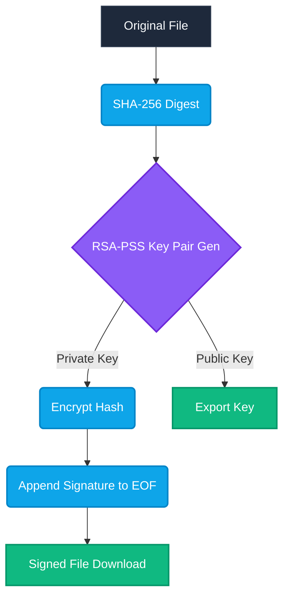
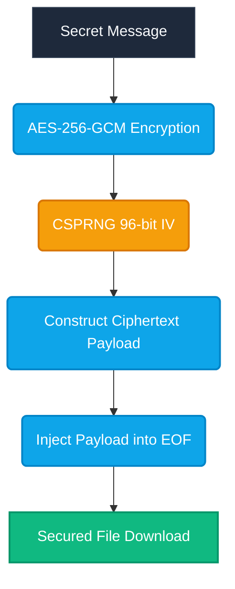

<div align="center">

# CryptoSeal

**Privacy-first cryptographic toolkit for digital signatures and encrypted steganography.**

**[🔥 View Live Application](https://crypto-seal-nine.vercel.app/)**

<br>

[]()
[]()
[]()
[]()

</div>

---

## Table of Contents

- [Project Philosophy](#project-philosophy)
- [Why CryptoSeal?](#why-cryptoseal)
- [Feature Comparison](#feature-comparison)
- [Architecture & Data Flow](#architecture--data-flow)
- [Cryptographic Specifications](#cryptographic-specifications)
- [Security & Privacy](#security--privacy)
- [Threat Model](#threat-model)
- [Technology Stack](#technology-stack)
- [Project Structure](#project-structure)
- [Installation & Usage](#installation--usage)
- [Browser Compatibility](#browser-compatibility)
- [Roadmap](#roadmap)
- [License](#license)
- [Author](#author)

---

## Project Philosophy

CryptoSeal exists to democratize secure, verifiable communication. As data privacy concerns escalate, relying on centralized servers to process sensitive cryptographic operations introduces unnecessary vulnerabilities. 

We engineered CryptoSeal as a **100% client-side, browser-only** application. By shifting the cryptographic workload directly to the user's device via the WebCrypto API, we eliminate the need for backends, databases, and network transit. The result is a stateless environment where you maintain absolute sovereignty over your keys and data.

---

## Why CryptoSeal?

Traditional digital signature and encryption platforms require you to upload your files to their servers, inherently requiring you to trust their infrastructure, storage policies, and network security. 

CryptoSeal flips this model:
- **Everything happens locally.**
- **Nothing leaves your device.**
- **No accounts or subscriptions.**
- **No servers.**
- **No internet required once loaded.**

---

## Feature Comparison

| Feature | CryptoSeal | Traditional Online Tools | CLI Tools (GPG/OpenSSL) |
| :--- | :---: | :---: | :---: |
| Local Processing | ✅ | ❌ | ✅ |
| Zero-Knowledge | ✅ | ❌ | ✅ |
| No Installation Required | ✅ | ✅ | ❌ |
| RSA-PSS Signatures | ✅ | Some | ✅ |
| AES-GCM Steganography | ✅ | ❌ | ❌ |
| Universal OS Support | ✅ | ✅ | Varies |

---

## Architecture & Data Flow

CryptoSeal utilizes End-of-File (EOF) binary manipulation to append cryptographic payloads without corrupting the original carrier file format.

### Digital Signature Flow



### Steganography Flow



---

## Cryptographic Specifications

CryptoSeal relies strictly on authenticated, industry-standard cryptographic primitives. 

**RSA-PSS (Digital Signatures)**
- Modulus Length: `2048-bit`
- Digest Algorithm: `SHA-256`
- Mask Generation Function: `MGF1`
- Salt Length: `32 bytes`

**AES-GCM (Steganography)**
- Key Length: `256-bit`
- Initialization Vector (IV): `96-bit`
- Authentication Tag: `128-bit`

---

## Security & Privacy

CryptoSeal is designed for absolute privacy.

- **No Uploads**: Files are read into memory using `ArrayBuffer` and processed entirely on the client.
- **Absolute Isolation**: Zero external network requests. All fonts and libraries are stored locally, combined with a strict `default-src 'self'` Content Security Policy.
- **Enterprise Edge Security**: Configured with `vercel.json` to enforce strict HSTS, Clickjacking protection (X-Frame-Options DENY), and rigid Permissions Policies.
- **No Telemetry**: Zero tracking, analytics, or cookies.
- **Volatile Keys**: Private keys are generated in RAM and destroyed upon closing the browser tab.
- **Secure Implementation**: Powered natively by the W3C WebCrypto API (implemented in C++ by browser vendors), preventing side-channel JavaScript timing attacks.

> **Important Warning**
> If a platform heavily modifies or compresses uploaded files (e.g., social media platforms, image optimizers, chat applications), the appended EOF payloads may be stripped. To preserve the signature or hidden data, share the modified files directly via email attachments, cloud drives, or ZIP archives.

---

## Threat Model

**CryptoSeal protects against:**
- ✔ File modification and unauthorized tampering.
- ✔ Man-in-the-middle (MITM) network interception (due to local processing).
- ✔ Unauthorized disclosure of steganographic payloads.
- ✔ Cryptographic brute-force (under modern classical computing).

**CryptoSeal DOES NOT protect against:**
- ✖ Malware or keyloggers installed on the host operating system.
- ✖ Compromised or malicious web browsers.
- ✖ Physical access to the unencrypted carrier files.
- ✖ Weak user-supplied passwords for AES key derivation.

---

## Technology Stack

**Frontend**
- HTML5
- CSS3 (Vanilla, CSS Variables)
- JavaScript ES6+

**Security & Processing**
- WebCrypto API
- TextEncoder / TextDecoder
- ArrayBuffer Binary Parsing

**Deployment**
- Static hosting compatible (GitHub Pages, Vercel, Netlify)

---

## Project Structure

```text
CryptoSeal
│
├── index.html
├── vercel.json
├── css/
│   ├── style.css
│   └── materialicons.ttf
├── js/
│   ├── core/
│   │   └── utils.js
│   └── modules/
│       ├── signature.js
│       ├── stego.js
│       └── camouflage.js
├── lib/
│   ├── pako.min.js
│   └── UPNG.min.js
├── pages/
│   ├── signature.html
│   ├── stego.html
│   └── camouflage.html
└── README.md
```

---

## Installation & Usage

### Quick Start (Local)

1. **Clone the repository**
   ```bash
   git clone https://github.com/kirtanpatel2201/CryptoSeal.git
   ```
2. **Navigate to the directory**
   ```bash
   cd CryptoSeal
   ```
3. **Run the application**
   Because there are no dependencies or build steps, simply open `index.html` in your browser.
   ```bash
   # Windows
   start index.html
   # macOS
   open index.html
   # Linux
   xdg-open index.html
   ```

---

## Browser Compatibility

CryptoSeal requires support for the modern WebCrypto API.

| Browser | Minimum Version | Support |
| :--- | :--- | :---: |
| Google Chrome | 37+ | ✅ |
| Mozilla Firefox | 34+ | ✅ |
| Microsoft Edge | 79+ | ✅ |
| Safari | 11+ | ✅ |
| Brave | 1.0+ | ✅ |

---

## Roadmap

**Planned Features & Priorities**

- ✅ Robust EOF Binary Parsing
- ✅ AES-GCM Implementation
- ✅ RSA-PSS Implementation
- ✅ LSB (Least Significant Bit) Deep Pixel Image Mode
- 🔄 Drag and Drop Batch Processing
- 🔄 Web Worker Integration (for non-blocking UI on large files)
- 🔄 Post-Quantum Cryptographic Standards (NIST Lattice-based)

---

## License

This project is licensed under the [MIT License](https://opensource.org/licenses/MIT).

---

## Author

**Kirtan Patel**
- GitHub: [@kirtanpatel2201](https://github.com/kirtanpatel2201)
